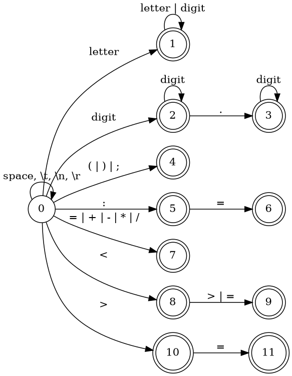

# 编译原理实验

## 实验要求

以下列词法表为例：

| 词法单元类型 | 词法单元  | 词素           |
| ------------ | --------- | -------------- |
| 关键字       | IF        | if             |
|              | THEN      | then           |
|              | ELSE      | else           |
|              | END       | end            |
|              | REPEAT    | repeat         |
|              | UNTIL     | until          |
|              | READ      | read           |
|              | WRITE     | write          |
| 自定义符     | ID        | example_id     |
|              | NUM       | 123            |
| 运算符       | ASSIGN    | :=             |
|              | RELOP     | =              |
|              |           | <>             |
|              |           | >              |
|              |           | <              |
|              |           | >=             |
|              |           | <=             |
|              | PLUS      | +              |
|              | MINUS     | -              |
|              | TIMES     | *              |
|              | OVER      | /              |
|              | LPAREN    | (              |
|              | RPAREN    | )              |
|              | SEMI      | ;              |
| 空格         | DELIMETER | space \t \n \r |

对于输入：

```pascal
read x; // input x
if 0 < x then /* compute when x>0 */
  fact := 1;
  repeat
    fact := fact * X;
    x := x-1
  until x = 0;
  write fact //output fact
end
```

它的词法分析输出应该为：

| tag                       | attr     |
| ------------------------- | -------- |
| READ                      |          |
| ID                        | 1        |
| SEMI                      | ;        |
| IF                        |          |
| NUM                       | 0.000000 |
| RELOP                     | <        |
| ID                        | 1        |
| THEN                      |          |
| ID                        | 2        |
| ASSIGN                    | :=       |
| NUM                       | 1.000000 |
| SEMI                      | ;        |
| REPEAT                    |          |
| ID                        | 2        |
| ASSIGN                    | :=       |
| ID                        | 2        |
| TIMES                     | *        |
| ID                        | 1        |
| SEMI                      | :        |
| ID                        | 1        |
| ASSIGN                    | :=       |
| ID                        | 1        |
| MINUS                     | -        |
| NUM                       | 1.000000 |
| UNTIL                     |          |
| ID                        | 1        |
| RELOP                     | =        |
| NUM                       | 0.000000 |
| SEMI                      | ;        |
| WRITE                     |          |
| ID                        | 2        |
| DOLLAR                    | $        |
| Annotations :             |          |
| // input x                |          |
| /\* compute when x > 0 */ |          |
| // output fact            |          |

## 词法分析



### 状态说明

- 状态0：初态，遇到space等DELIMETER时回到初态，遇到字母进入状态1，遇到数字进入状态2，遇到(|)|;进入状态4，遇到":"进入状态5，遇到=|+|-|*|/进入状态7，遇到<进入状态8，遇到>进入状态10。
- 状态1：终态，对应保留字或标识符。遇到字母或数字保留在状态1。
- 状态2：对应整数。遇到数字保留在状态2，遇到“.”进入状态3。
- 状态3：对应小数。遇到数字保留在状态3。
- 状态4：对应分割符。
- 状态5：中间状态，遇到“=”进入状态6。
- 状态6：终态，对应ASSIGN。
- 状态7：终态，对应运算符。
- 状态8：中间状态，遇到>或=进入状态9。
- 状态9：终态，对应RELOP。
- 状态10：中间状态，遇到=进入状态11。
- 状态11：终态，对应RELOP。
