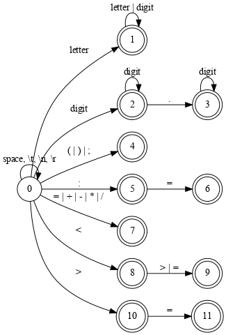
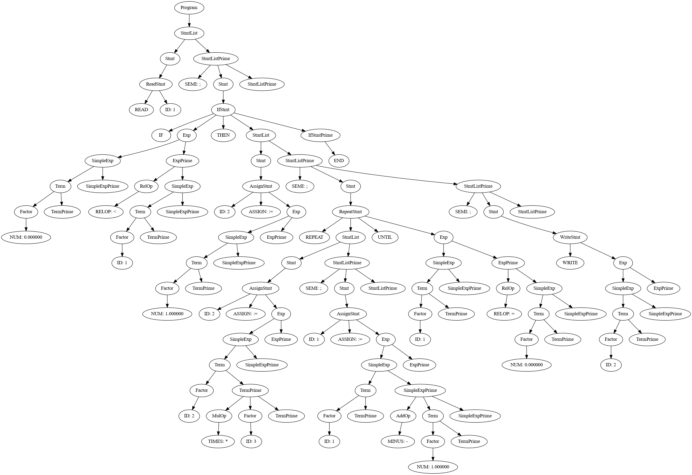

# 编译原理实验

## 实验要求

以下列词法表为例：

| 词法单元类型 | 词法单元  | 词素           |
| ------------ | --------- | -------------- |
| 关键字       | IF        | if             |
|              | THEN      | then           |
|              | ELSE      | else           |
|              | END       | end            |
|              | REPEAT    | repeat         |
|              | UNTIL     | until          |
|              | READ      | read           |
|              | WRITE     | write          |
| 自定义符     | ID        | example_id     |
|              | NUM       | 123            |
| 运算符       | ASSIGN    | :=             |
|              | RELOP     | =              |
|              |           | <>             |
|              |           | >              |
|              |           | <              |
|              |           | >=             |
|              |           | <=             |
|              | PLUS      | +              |
|              | MINUS     | -              |
|              | TIMES     | *              |
|              | OVER      | /              |
|              | LPAREN    | (              |
|              | RPAREN    | )              |
|              | SEMI      | ;              |
| 空格         | DELIMETER | space \t \n \r |

对于输入：

```pascal
read x; // input x
if 0 < x then /* compute when x>0 */
  fact := 1;
  repeat
    fact := fact * X;
    x := x-1
  until x = 0;
  write fact //output fact
end
```

它的词法分析输出应该为：

| tag                       | attr     |
| ------------------------- | -------- |
| READ                      |          |
| ID                        | 1        |
| SEMI                      | ;        |
| IF                        |          |
| NUM                       | 0.000000 |
| RELOP                     | <        |
| ID                        | 1        |
| THEN                      |          |
| ID                        | 2        |
| ASSIGN                    | :=       |
| NUM                       | 1.000000 |
| SEMI                      | ;        |
| REPEAT                    |          |
| ID                        | 2        |
| ASSIGN                    | :=       |
| ID                        | 2        |
| TIMES                     | *        |
| ID                        | 1        |
| SEMI                      | :        |
| ID                        | 1        |
| ASSIGN                    | :=       |
| ID                        | 1        |
| MINUS                     | -        |
| NUM                       | 1.000000 |
| UNTIL                     |          |
| ID                        | 1        |
| RELOP                     | =        |
| NUM                       | 0.000000 |
| SEMI                      | ;        |
| WRITE                     |          |
| ID                        | 2        |
| DOLLAR                    | $        |
| Annotations :             |          |
| // input x                |          |
| /\* compute when x > 0 */ |          |
| // output fact            |          |

## 词法分析



### 状态说明

- 状态0：初态，遇到space等DELIMETER时回到初态，遇到字母进入状态1，遇到数字进入状态2，遇到(|)|;进入状态4，遇到":"进入状态5，遇到=|+|-|*|/进入状态7，遇到<进入状态8，遇到>进入状态10。
- 状态1：终态，对应保留字或标识符。遇到字母或数字保留在状态1。
- 状态2：对应整数。遇到数字保留在状态2，遇到“.”进入状态3。
- 状态3：对应小数。遇到数字保留在状态3。
- 状态4：对应分割符。
- 状态5：中间状态，遇到“=”进入状态6。
- 状态6：终态，对应ASSIGN。
- 状态7：终态，对应运算符。
- 状态8：中间状态，遇到>或=进入状态9。
- 状态9：终态，对应RELOP。
- 状态10：中间状态，遇到=进入状态11。
- 状态11：终态，对应RELOP。

### 词法分析器代码实现

词法分析器的代码实现分为以下几个部分：

1. **头文件 `tokens.h`**：定义了词法单元类型的枚举 `TokenType` 以及对应的字符串表示 `tokenNames`。
2. **词法分析器 `lexer.c`**：实现了词法分析的具体逻辑，包括读取输入文件、识别词法单元、输出词法单元及其属性。

#### 头文件 `tokens.h`

```c
#ifndef TOKENS_H
#define TOKENS_H

typedef enum {
    IF,
    THEN,
    ELSE,
    END,
    REPEAT,
    UNTIL,
    READ,
    WRITE,
    ID,
    NUM,
    ASSIGN,
    RELOP,
    PLUS,
    MINUS,
    TIMES,
    OVER,
    LPAREN,
    RPAREN,
    SEMI,
    DELIMETER,
    COMMENT,
    DOLLAR
} TokenType;

const char *tokenNames[] = {
    "IF", "THEN", "ELSE", "END", "REPEAT", "UNTIL", "READ", "WRITE", "ID", "NUM", "ASSIGN", "RELOP", "PLUS", "MINUS", "TIMES", "OVER", "LPAREN", "RPAREN", "SEMI", "DELIMETER", "COMMENT", "DOLLAR"};

#endif // TOKENS_H
```

#### 词法分析器 `lexer.c`

```c
#include <stdio.h>
#include <ctype.h>
#include <string.h>
#include <stdlib.h>

typedef enum {
    READ, ID, SEMI, IF, NUM, RELOP, THEN, ASSIGN, REPEAT, TIMES, UNTIL, WRITE, MINUS, DOLLAR, END, ELSE, COMMENT, PLUS, OVER, LPAREN, RPAREN
} TokenType;

void printToken(TokenType token, const char *attr) {
    const char *tokenNames[] = {
        "READ", "ID", "SEMI", "IF", "NUM", "RELOP", "THEN", "ASSIGN", "REPEAT", "TIMES", "UNTIL", "WRITE", "MINUS", "DOLLAR", "END", "ELSE", "COMMENT", "PLUS", "OVER", "LPAREN", "RPAREN"};
    printf("%s\t%s\n", tokenNames[token], attr);
}

typedef struct {
    char name[256];
    int id;
} Symbol;

Symbol symbolTable[256];
int symbolCount = 0;

int lookupSymbol(const char *name) {
    for (int i = 0; i < symbolCount; i++) {
        if (strcmp(symbolTable[i].name, name) == 0) {
            return symbolTable[i].id;
        }
    }
    return -1;
}

int addSymbol(const char *name) {
    strcpy(symbolTable[symbolCount].name, name);
    symbolTable[symbolCount].id = symbolCount + 1;
    return symbolTable[symbolCount++].id;
}
```

上面的代码定义了词法单元的类型、打印词法单元的函数以及符号表的相关操作。

```c
void processFile(const char *filePath) {
    FILE *file = fopen(filePath, "r");
    if (!file) {
        perror("Failed to open file");
        exit(EXIT_FAILURE);
    }

    char buffer[256];
    int bufferIndex = 0;
    int c;
    char annotations[1024] = "";
    int annotationIndex = 0;

    while ((c = fgetc(file)) != EOF) {
        if (isspace(c)) {
            continue;
        }

        if (isalpha(c)) {
            bufferIndex = 0;
            while (isalpha(c) || isdigit(c)) {
                buffer[bufferIndex++] = c;
                c = fgetc(file);
            }
            buffer[bufferIndex] = '\0';
            ungetc(c, file);

            if (strcmp(buffer, "read") == 0) {
                printToken(READ, "");
            } else if (strcmp(buffer, "if") == 0) {
                printToken(IF, "");
            } else if (strcmp(buffer, "then") == 0) {
                printToken(THEN, "");
            } else if (strcmp(buffer, "repeat") == 0) {
                printToken(REPEAT, "");
            } else if (strcmp(buffer, "until") == 0) {
                printToken(UNTIL, "");
            } else if (strcmp(buffer, "write") == 0) {
                printToken(WRITE, "");
            } else if (strcmp(buffer, "end") == 0) {
                printToken(END, "");
            } else if (strcmp(buffer, "else") == 0) {
                printToken(ELSE, "");
            } else {
                int id = lookupSymbol(buffer);
                if (id == -1) {
                    id = addSymbol(buffer);
                }
                char idStr[10];
                sprintf(idStr, "%d", id);
                printToken(ID, idStr);
            }
        } else if (isdigit(c)) {
            bufferIndex = 0;
            while (isdigit(c)) {
                buffer[bufferIndex++] = c;
                c = fgetc(file);
            }
            if (c == '.') {
                buffer[bufferIndex++] = c;
                c = fgetc(file);
                while (isdigit(c)) {
                    buffer[bufferIndex++] = c;
                    c = fgetc(file);
                }
            }
            buffer[bufferIndex] = '\0';
            ungetc(c, file);
            double num = atof(buffer);
            sprintf(buffer, "%.6f", num);
            printToken(NUM, buffer);
        } else if (c == '/') {
            c = fgetc(file);
            if (c == '/') {
                // Single line comment
                bufferIndex = 0;
                buffer[bufferIndex++] = '/';
                buffer[bufferIndex++] = '/';
                while ((c = fgetc(file)) != '\n' && c != EOF) {
                    buffer[bufferIndex++] = c;
                }
                buffer[bufferIndex] = '\0';
                strcat(annotations, buffer);
                strcat(annotations, "\n");
            } else if (c == '*') {
                // Multi-line comment
                bufferIndex = 0;
                buffer[bufferIndex++] = '/';
                buffer[bufferIndex++] = '*';
                while (1) {
                    c = fgetc(file);
                    if (c == EOF) {
                        break;
                    }
                    buffer[bufferIndex++] = c;
                    if (c == '*') {
                        c = fgetc(file);
                        if (c == '/') {
                            buffer[bufferIndex++] = '/';
                            break;
                        } else {
                            ungetc(c, file);
                        }
                    }
                }
                buffer[bufferIndex] = '\0';
                strcat(annotations, buffer);
                strcat(annotations, "\n");
            } else {
                ungetc(c, file);
                printToken(OVER, "/");
            }
        } else {
            switch (c) {
            case ';':
                printToken(SEMI, ";");
                break;
            case ':':
                if ((c = fgetc(file)) == '=') {
                    printToken(ASSIGN, ":=");
                } else {
                    ungetc(c, file);
                }
                break;
            case '<':
                if ((c = fgetc(file)) == '=' || c == '>') {
                    buffer[0] = '<';
                    buffer[1] = c;
                    buffer[2] = '\0';
                    printToken(RELOP, buffer);
                } else {
                    ungetc(c, file);
                    printToken(RELOP, "<");
                }
                break;
            case '>':
                if ((c = fgetc(file)) == '=') {
                    printToken(RELOP, ">=");
                } else {
                    ungetc(c, file);
                    printToken(RELOP, ">");
                }
                break;
            case '=':
                printToken(RELOP, "=");
                break;
            case '+':
                printToken(PLUS, "+");
                break;
            case '-':
                printToken(MINUS, "-");
                break;
            case '*':
                printToken(TIMES, "*");
                break;
            case '(':
                printToken(LPAREN, "(");
                break;
            case ')':
                printToken(RPAREN, ")");
                break;
            default:
                break;
            }
        }
    }

    fclose(file);

    // Print annotations
    printf("Annotations :\n%s", annotations);
}

int main(int argc, char *argv[]) {
    if (argc != 2) {
        fprintf(stderr, "Usage: %s <file_path>\n", argv[0]);
        return EXIT_FAILURE;
    }

    processFile(argv[1]);

    return EXIT_SUCCESS;
}
```

上面的代码实现了词法分析器的主要逻辑，包括处理关键字、标识符、数字、运算符、分隔符和注释等。

### 心得体会

在实现词法分析器的过程中，我们遇到了多个挑战，特别是在处理多行注释时。以下是我们在处理多行注释时的几个版本的代码以及遇到的问题：

#### 初始版本

在初始版本中，我们简单地处理多行注释，假设注释的结束符 `*/` 总是会正确出现。然而，这种假设在实际情况下并不总是成立。

```c
if (c == '*') {
    while ((c = fgetc(file)) != '/' && c != EOF) {
        buffer[bufferIndex++] = c;
    }
    buffer[bufferIndex++] = '/';
}
```

#### 改进版本

在改进版本中，我们增加了对 `EOF` 的检查，以确保在文件结束时能够正确处理未闭合的注释。然而，这个版本仍然存在一个问题：如果多行注释内出现了单个的 `*` 号，其后面不是 `/`，那么会导致这个符号后面的字符丢失。

```c
if (c == '*') {
    while (1) {
        c = fgetc(file);
        if (c == EOF) {
            break;
        }
        buffer[bufferIndex++] = c;
        if (c == '*') {
            c = fgetc(file);
            if (c == '/') {
                buffer[bufferIndex++] = '/';
                break;
            }
        }
    }
}
```

#### 最终版本

在最终版本中，我们通过使用 `ungetc` 函数来解决上述问题。具体来说，当我们遇到 `*` 号时，会读取下一个字符，如果不是 `/`，则将其放回输入流中。这种方法确保了多行注释内的所有字符都能被正确处理。

```c
if (c == '*') {
    while (1) {
        c = fgetc(file);
        if (c == EOF) {
            break;
        }
        buffer[bufferIndex++] = c;
        if (c == '*') {
            c = fgetc(file);
            if (c == '/') {
                buffer[bufferIndex++] = '/';
                break;
            } else {
                ungetc(c, file);
            }
        }
    }
}
```

#### 短路机制的问题

在处理多行注释时，我们还遇到了C语言的短路机制问题。具体来说，只有当当前字符是 `*` 时，才有可能执行 `fgetc`，并且才需要调用 `ungetc`。这种短路机制导致我们在编写代码时需要特别小心，以确保逻辑的正确性。

```c
if (c == '*') {
    c = fgetc(file);
    if (c == '/') {
        buffer[bufferIndex++] = '/';
        break;
    } else {
        ungetc(c, file);
    }
}
```

通过这些改进和优化，我们最终实现了一个能够正确处理各种输入的词法分析器。这不仅提高了我们的编程技巧，也加深了我们对编译原理的理解。

#### 编译和运行词法分析器

```bash
gcc lexer.c -o lexer
./lexer input.txt > output.txt
```

运行结果将输出到 `output.txt` 文件中。

## 语法分析

以下是根据之前定义的词法单元构建的文法：

```plaintext
<program> ::= <stmt_list>

<stmt_list> ::= <stmt> ; <stmt_list> | <stmt>

<stmt> ::= <if_stmt> | <repeat_stmt> | <assign_stmt> | <read_stmt> | <write_stmt>

<if_stmt> ::= IF <exp> THEN <stmt_list> END | IF <exp> THEN <stmt_list> ELSE <stmt_list> END

<repeat_stmt> ::= REPEAT <stmt_list> UNTIL <exp>

<assign_stmt> ::= ID ASSIGN <exp>

<read_stmt> ::= READ ID

<write_stmt> ::= WRITE <exp>

<exp> ::= <simple_exp> <comparison_op> <simple_exp> | <simple_exp>

<comparison_op> ::= RELOP

<simple_exp> ::= <term> <add_op> <simple_exp> | <term>

<add_op> ::= PLUS | MINUS

<term> ::= <factor> <mul_op> <term> | <factor>

<mul_op> ::= TIMES | OVER

<factor> ::= LPAREN <exp> RPAREN | ID | NUM
```

### 文法处理

在后续的图表中，我们将使用简写符号来表示非终结符和终结符。大写字母代表非终结符，小写字母代表终结符。例如：

- `<program>` 用 `P` 表示
- `<stmt_list>` 用 `SL` 表示
- `<stmt>` 用 `S` 表示
- `<if_stmt>` 用 `I` 表示
- `<repeat_stmt>` 用 `R` 表示
- `<assign_stmt>` 用 `A` 表示
- `<read_stmt>` 用 `RD` 表示
- `<write_stmt>` 用 `W` 表示
- `<exp>` 用 `E` 表示
- `<comparison_op>` 用 `RO` 表示
- `<simple_exp>` 用 `SE` 表示
- `<add_op>` 用 `AO` 表示
- `<term>` 用 `T` 表示
- `<mul_op>` 用 `MO` 表示
- `<factor>` 用 `F` 表示

LL(1) 文法需要先提取左公因子。以下是提取左公因子后的文法：

```plaintext
P → SL

SL → S SL'

SL' → ; SL | ε

S → I | R | A | RD | W

I → if E then SL I'

I' → end | else SL end

R → repeat SL until E

A → id := E

RD → read id

W → write E

E → SE E'

E' → RO SE | ε

RO → relop

SE → T SE'

SE' → AO T SE' | ε

AO → plus | minus

T → F T'

T' → MO F T' | ε

MO → times | over

F → ( E ) | id | num
```

### First 集和 Follow 集

以下是每个非终结符的 First 集和 Follow 集：

<table>
    <tr>
        <th>非终结符</th>
        <th>缩写</th>
        <th>文法表达式</th>
        <th>First 集</th>
        <th>Follow 集</th>
    </tr>
    <tr>
        <td>Program</td>
        <td>P</td>
        <td>P → SL</td>
        <td>if</br>repeat</br>id</br>read</br>write</td>
        <td>$</td>
    </tr>
    <tr>
        <td>StmtList</td>
        <td>SL</td>
        <td>SL → S SL'</td>
        <td>if</br>repeat</br>id</br>read</br>write</td>
        <td>$</br>end</br>else</br>until</td>
    </tr>
    <tr>
        <td rowspan="2">StmtList'</td>
        <td rowspan="2">SL'</td>
        <td>SL' → ; SL</td>
        <td>;</td>
        <td rowspan="2">$</br>end</br>else</br>until</td>
    </tr>
    <tr>
        <td>SL' → ε</td>
        <td>$</br>end</br>else</br>until</td>
    </tr>
    <tr>
        <td rowspan="5">Stmt</td>
        <td rowspan="5">S</td>
        <td>S → I</td>
        <td>if</td>
        <td rowspan="5">;</br>$</br>end</br>else</br>until</td>
    </tr>
    <tr>
        <td>S → R</td>
        <td>repeat</td>
    </tr>
    <tr>
        <td>S → A</td>
        <td>id</td>
    </tr>
    <tr>
        <td>S → RD</td>
        <td>read</td>
    </tr>
    <tr>
        <td>S → W</td>
        <td>write</td>
    </tr>
    <tr>
        <td>IfStmt</td>
        <td>I</td>
        <td>I → if E then SL I'</td>
        <td>if</td>
        <td>;</br>$</br>end</br>else</br>until</td>
    </tr>
    <tr>
        <td rowspan="2">IfStmt'</td>
        <td rowspan="2">I'</td>
        <td>I' → end</td>
        <td>end</td>
        <td rowspan="2">;</br>$</br>end</br>else</br>until</td>
    </tr>
    <tr>
        <td>I' → else SL end</td>
        <td>else</td>
    </tr>
    <tr>
        <td>RepeatStmt</td>
        <td>R</td>
        <td>R → repeat SL until E</td>
        <td>repeat</td>
        <td>;</br>$</br>end</br>else</br>until</td>
    </tr>
    <tr>
        <td>AssignStmt</td>
        <td>A</td>
        <td>A → id := E</td>
        <td>id</td>
        <td>;</br>$</br>end</br>else</br>until</td>
    </tr>
    <tr>
        <td>ReadStmt</td>
        <td>RD</td>
        <td>RD → read id</td>
        <td>read</td>
        <td>;</br>$</br>end</br>else</br>until</td>
    </tr>
    <tr>
        <td>WriteStmt</td>
        <td>W</td>
        <td>W → write E</td>
        <td>write</td>
        <td>;</br>$</br>end</br>else</br>until</td>
    </tr>
    <tr>
        <td>Exp</td>
        <td>E</td>
        <td>E → SE E'</td>
        <td>(</br>id</br>num</td>
        <td>then</br>;</br>$</br>end</br>else</br>until</br>)</td>
    </tr>
    <tr>
        <td rowspan="2">Exp'</td>
        <td rowspan="2">E'</td>
        <td>E' → RO SE</td>
        <td>relop</td>
        <td rowspan="2">then</br>;</br>$</br>end</br>else</br>until</br>)</td>
    </tr>
    <tr>
        <td>E' → ε</td>
        <td>then</br>;</br>$</br>end</br>else</br>until</br>)</td>
    </tr>
    <tr>
        <td>RelOp</td>
        <td>RO</td>
        <td>RO → relop</td>
        <td>relop</td>
        <td>(</br>id</br>num</td>
    </tr>
    <tr>
        <td>SimpleExp</td>
        <td>SE</td>
        <td>SE → T SE'</td>
        <td>(</br>id</br>num</td>
        <td>then</br>;</br>$</br>end</br>else</br>until</br>)</td>
    </tr>
    <tr>
        <td rowspan="2">SimpleExp'</td>
        <td rowspan="2">SE'</td>
        <td>SE' → AO T SE'</td>
        <td>plus</br>minus</td>
        <td rowspan="2">then</br>;</br>$</br>end</br>else</br>until</br>)</td>
    </tr>
    <tr>
        <td>SE' → ε</td>
        <td>then</br>;</br>$</br>end</br>else</br>until</br>)</td>
    </tr>
    <tr>
        <td rowspan="2">AddOp</td>
        <td rowspan="2">AO</td>
        <td>AO → plus</td>
        <td>plus</td>
        <td rowspan="2">(</br>id</br>num</td>
    </tr>
    <tr>
        <td>AO → minus</td>
        <td>minus</td>
    </tr>
    <tr>
        <td>Term</td>
        <td>T</td>
        <td>T → F T'</td>
        <td>(</br>id</br>num</td>
        <td>plus</br>minus</br>then</br>;</br>$</br>end</br>else</br>until</br>)</td>
    </tr>
    <tr>
        <td rowspan="2">Term'</td>
        <td rowspan="2">T'</td>
        <td>T' → MO F T'</td>
        <td>times</br>over</td>
        <td rowspan="2">plus</br>minus</br>then</br>;</br>$</br>end</br>else</br>until</br>)</td>
    </tr>
    <tr>
        <td>T' → ε</td>
        <td>plus</br>minus</br>then</br>;</br>$</br>end</br>else</br>until</br>)</td>
    </tr>
    <tr>
        <td rowspan="2">MulOp</td>
        <td rowspan="2">MO</td>
        <td>MO → times</td>
        <td>times</td>
        <td rowspan="2">(</br>id</br>num</td>
    </tr>
    <tr>
        <td>MO → over</td>
        <td>over</td>
    </tr>
    <tr>
        <td rowspan="3">Factor</td>
        <td rowspan="3">F</td>
        <td>F → ( E )</td>
        <td>(</td>
        <td rowspan="3">times</br>over</br>plus</br>minus</br>then</br>;</br>$</br>end</br>else</br>until</br>)</td>
    </tr>
    <tr>
        <td>F → id</td>
        <td>id</td>
    </tr>
    <tr>
        <td>F → num</td>
        <td>num</td>
    </tr>
</table>

### LL(1) 分析表

以下是根据之前定义的 LL(1) 文法构建的 LL(1) 分析表：

|         | if                | repeat              | id          | read        | write       | ;        | end    | else           | until | relop    | plus         | minus        | times      | over       | (          | )     | num        | :=  | then  | $     |
| ------- | ----------------- | ------------------- | ----------- | ----------- | ----------- | -------- | ------ | -------------- | ----- | -------- | ------------ | ------------ | ---------- | ---------- | ---------- | ----- | ---------- | --- | ----- | ----- |
| **P**   | P→SL              | P→SL                | P→SL        | P→SL        | P→SL        |          |        |                |       |          |              |              |            |            |            |       |            |     |       |       |
| **SL**  | SL -> S SL'       | SL -> S SL'         | SL -> S SL' | SL -> S SL' | SL -> S SL' |          |        |                |       |          |              |              |            |            |            |       |            |     |       |       |
| **SL'** |                   |                     |             |             |             | SL'→;SL' | SL'→ε  | SL'→ε          | SL'→ε |          |              |              |            |            |            |       |            |     |       | SL'→ε |
| **S**   | S→I               | S→R                 | S→A         | S→RD        | S→W         |          |        |                |       |          |              |              |            |            |            |       |            |     |       |       |
| **I**   | I→if E then SL I' |                     |             |             |             |          |        |                |       |          |              |              |            |            |            |       |            |     |       |       |
| **I'**  |                   |                     |             |             |             |          | I'→end | I'→else SL end |       |          |              |              |            |            |            |       |            |     |       |       |
| **R**   |                   | R→repeat SL until E |             |             |             |          |        |                |       |          |              |              |            |            |            |       |            |     |       |       |
| **A**   |                   |                     | A→id := E   |             |             |          |        |                |       |          |              |              |            |            |            |       |            |     |       |       |
| **RD**  |                   |                     |             | RD→read id  |             |          |        |                |       |          |              |              |            |            |            |       |            |     |       |       |
| **W**   |                   |                     |             |             | W→write E   |          |        |                |       |          |              |              |            |            |            |       |            |     |       |       |
| **E**   |                   |                     | E -> SE E'  |             |             |          |        |                |       |          |              |              |            |            | E -> SE E' |       | E -> SE E' |     |       |       |
| **E'**  |                   |                     |             |             |             | E'→ε     | E'→ε   | E'→ε           | E'→ε  | E'→RO SE |              |              |            |            |            | E'→ε  |            |     | E'→ε  | E'→ε  |
| **RO**  |                   |                     |             |             |             |          |        |                |       | RO→relop |              |              |            |            |            |       |            |     |       |       |
| **SE**  |                   |                     | SE→T SE'    |             |             |          |        |                |       |          |              |              |            |            | SE→T SE'   |       | SE→T SE'   |     |       |       |
| **SE'** |                   |                     |             |             |             | SE'→ε    | SE'→ε  | SE'→ε          | SE'→ε |          | SE'→AO T SE' | SE'→AO T SE' |            |            |            | SE'→ε |            |     | SE'→ε | SE'→ε |
| **AO**  |                   |                     |             |             |             |          |        |                |       |          | AO→plus      | AO→minus     |            |            |            |       |            |     |       |       |
| **T**   |                   |                     | T→F T'      |             |             |          |        |                |       |          |              |              |            |            | T→F T'     |       | T→F T'     |     |       |       |
| **T'**  |                   |                     |             |             |             | T'→ε     | T'→ε   | T'→ε           | T'→ε  |          | T'→ε         | T'→ε         | T'→MO F T' | T'→MO F T' |            | T'→ε  |            |     | T'→ε  | T'→ε  |
| **MO**  |                   |                     |             |             |             |          |        |                |       |          |              |              | MO→times   | MO→over    |            |       |            |     |       |       |
| **F**   |                   |                     | F→id        |             |             |          |        |                |       |          |              |              |            |            | F→(E)      |       | F→num      |     |       |       |

### 语法分析器代码实现

在本节中，我们将介绍如何实现一个基于递归下降的语法分析器。该分析器使用LL(1)分析表，并且包含调试功能，可以在调试模式下输出进入和离开每个解析函数的调试信息。

#### 包含必要的头文件和定义全局变量

首先，我们包含必要的头文件，并定义全局变量。`debug` 变量用于控制调试模式，`tokens` 数组用于存储从词法分析器读取的词法单元，`tokenIndex` 和 `currentToken` 分别用于记录词法单元的总数和当前处理的词法单元索引。

```c
#include <stdio.h>
#include <stdlib.h>
#include <string.h>
#include "tokens.h"

#define MAX_TOKENS 1024

int debug = 0; // 调试开关，0 表示关闭，1 表示开启

typedef struct {
    TokenType token;
    char attr[256];
} Token;

Token tokens[MAX_TOKENS];
int tokenIndex = 0;
int currentToken = 0;
```

#### 读取词法分析器输出

`readTokens` 函数从词法分析器的输出文件中读取词法单元，并将其存储在 `tokens` 数组中。该函数处理每一行，判断是否包含属性，并将 `tokenName` 转换为 `TokenType` 枚举值。

```c
void readTokens(const char *filePath) {
    FILE *file = fopen(filePath, "r");
    if (!file) {
        perror("无法打开词法分析器输出文件");
        exit(EXIT_FAILURE);
    }

    char line[512];
    while (fgets(line, sizeof(line), file)) {
        line[strcspn(line, "\n")] = 0;

        char tokenName[256];
        char attr[256];
        TokenType tokenType;

        char *tabPos = strchr(line, '\t');
        if (tabPos) {
            *tabPos = 0;
            strcpy(tokenName, line);
            strcpy(attr, tabPos + 1);
        } else {
            strcpy(tokenName, line);
            attr[0] = '\0';
        }

        if (strcmp(tokenName, "IF") == 0)
            tokenType = IF;
        else if (strcmp(tokenName, "THEN") == 0)
            tokenType = THEN;
        else if (strcmp(tokenName, "ELSE") == 0)
            tokenType = ELSE;
        else if (strcmp(tokenName, "END") == 0)
            tokenType = END;
        else if (strcmp(tokenName, "REPEAT") == 0)
            tokenType = REPEAT;
        else if (strcmp(tokenName, "UNTIL") == 0)
            tokenType = UNTIL;
        else if (strcmp(tokenName, "READ") == 0)
            tokenType = READ;
        else if (strcmp(tokenName, "WRITE") == 0)
            tokenType = WRITE;
        else if (strcmp(tokenName, "ID") == 0)
            tokenType = ID;
        else if (strcmp(tokenName, "NUM") == 0)
            tokenType = NUM;
        else if (strcmp(tokenName, "ASSIGN") == 0)
            tokenType = ASSIGN;
        else if (strcmp(tokenName, "RELOP") == 0)
            tokenType = RELOP;
        else if (strcmp(tokenName, "PLUS") == 0)
            tokenType = PLUS;
        else if (strcmp(tokenName, "MINUS") == 0)
            tokenType = MINUS;
        else if (strcmp(tokenName, "TIMES") == 0)
            tokenType = TIMES;
        else if (strcmp(tokenName, "OVER") == 0)
            tokenType = OVER;
        else if (strcmp(tokenName, "LPAREN") == 0)
            tokenType = LPAREN;
        else if (strcmp(tokenName, "RPAREN") == 0)
            tokenType = RPAREN;
        else if (strcmp(tokenName, "SEMI") == 0)
            tokenType = SEMI;
        else if (strcmp(tokenName, "DOLLAR") == 0)
            tokenType = DOLLAR;
        else {
            printf("未知的词法单元：%s\n", tokenName);
            exit(EXIT_FAILURE);
        }

        tokens[tokenIndex].token = tokenType;
        strcpy(tokens[tokenIndex].attr, attr);
        tokenIndex++;

        if (tokenType == DOLLAR) {
            break;
        }
    }
    fclose(file);
}
```

#### 获取和匹配词法单元

`getToken` 函数返回当前词法单元的类型，`match` 函数用于匹配并消耗期望的词法单元。如果匹配成功，`currentToken` 递增；否则，输出语法错误信息并退出程序。

```c
TokenType getToken() {
    return tokens[currentToken].token;
}

void match(TokenType expected) {
    if (getToken() == expected) {
        if (debug) {
            printf("匹配：%s\n", tokenNames[expected]);
        }
        currentToken++;
    } else {
        printf("语法错误：期望 %d，得到 %d\n", expected, getToken());
        exit(EXIT_FAILURE);
    }
}
```

#### 递归下降解析函数声明

我们声明了所有递归下降解析函数，这些函数将根据LL(1)分析表和文法规则实现。

```c
void Program();
void StmtList();
void StmtListPrime();
void Stmt();
void IfStmt();
void IfStmtPrime();
void RepeatStmt();
void AssignStmt();
void ReadStmt();
void WriteStmt();
void Exp();
void ExpPrime();
void RelOp();
void SimpleExp();
void SimpleExpPrime();
void AddOp();
void Term();
void TermPrime();
void MulOp();
void Factor();
```

#### 解析程序和语句列表

`Program` 函数解析程序的起始符号，并调用 `StmtList` 函数解析语句列表。`StmtList` 函数解析一个语句并调用 `StmtListPrime` 解析后续语句。

```c
void Program() {
    if (debug)
        printf("进入：Program\n");
    if (getToken() == IF || getToken() == REPEAT || getToken() == ID || getToken() == READ || getToken() == WRITE) {
        StmtList();
        if (getToken() == DOLLAR) {
            if (debug)
                printf("匹配：DOLLAR\n");
            printf("语法分析成功！\n");
        } else {
            printf("语法错误：程序末尾缺少 $ 符号\n");
            exit(EXIT_FAILURE);
        }
    } else {
        printf("语法错误：无法识别的起始符号\n");
        exit(EXIT_FAILURE);
    }
    if (debug)
        printf("离开：Program\n");
}

void StmtList() {
    if (debug)
        printf("进入：StmtList\n");
    Stmt();
    StmtListPrime();
    if (debug)
        printf("离开：StmtList\n");
}
```

#### 解析语句列表的后续部分

`StmtListPrime` 函数解析语句列表的后续部分。如果当前词法单元是分号，则匹配分号并解析下一个语句；否则，解析空产生式。

```c
void StmtListPrime() {
    if (debug)
        printf("进入：StmtListPrime\n");
    if (getToken() == SEMI) {
        match(SEMI);
        Stmt();
        StmtListPrime();
    } else if (getToken() == END || getToken() == ELSE || getToken() == UNTIL || getToken() == DOLLAR || getToken() == THEN) {
        // SL' -> ε
    } else {
        printf("语法错误：期望分号或结束符号\n");
        exit(EXIT_FAILURE);
    }
    if (debug)
        printf("离开：StmtListPrime\n");
}
```

#### 解析语句

`Stmt` 函数根据当前词法单元的类型调用相应的解析函数，如 `IfStmt`、`RepeatStmt`、`AssignStmt`、`ReadStmt` 和 `WriteStmt`。

```c
void Stmt() {
    if (debug)
        printf("进入：Stmt\n");
    if (getToken() == IF) {
        IfStmt();
    } else if (getToken() == REPEAT) {
        RepeatStmt();
    } else if (getToken() == ID) {
        AssignStmt();
    } else if (getToken() == READ) {
        ReadStmt();
    } else if (getToken() == WRITE) {
        WriteStmt();
    } else {
        printf("语法错误：无法识别的语句\n");
        exit(EXIT_FAILURE);
    }
    if (debug)
        printf("离开：Stmt\n");
}
```

#### 解析 if 语句

`IfStmt` 函数解析 if 语句，包括条件表达式、then 部分的语句列表和 else 部分（如果存在）。

```c
void IfStmt() {
    if (debug)
        printf("进入：IfStmt\n");
    match(IF);
    Exp();
    match(THEN);
    StmtList();
    IfStmtPrime();
    if (debug)
        printf("离开：IfStmt\n");
}

void IfStmtPrime() {
    if (debug)
        printf("进入：IfStmtPrime\n");
    if (getToken() == END) {
        match(END);
    } else if (getToken() == ELSE) {
        match(ELSE);
        StmtList();
        match(END);
    } else {
        printf("语法错误：期望 end 或 else\n");
        exit(EXIT_FAILURE);
    }
    if (debug)
        printf("离开：IfStmtPrime\n");
}
```

#### 解析其他语句

类似地，我们实现了 `RepeatStmt`、`AssignStmt`、`ReadStmt` 和 `WriteStmt` 函数，分别解析 repeat 语句、赋值语句、read 语句和 write 语句。

```c
void RepeatStmt() {
    if (debug)
        printf("进入：RepeatStmt\n");
    match(REPEAT);
    StmtList();
    match(UNTIL);
    Exp();
    if (debug)
        printf("离开：RepeatStmt\n");
}

void AssignStmt() {
    if (debug)
        printf("进入：AssignStmt\n");
    match(ID);
    match(ASSIGN);
    Exp();
    if (debug)
        printf("离开：AssignStmt\n");
}

void ReadStmt() {
    if (debug)
        printf("进入：ReadStmt\n");
    match(READ);
    match(ID);
    if (debug)
        printf("离开：ReadStmt\n");
}

void WriteStmt() {
    if (debug)
        printf("进入：WriteStmt\n");
    match(WRITE);
    Exp();
    if (debug)
        printf("离开：WriteStmt\n");
}
```

#### 解析表达式

`Exp` 函数解析表达式，调用 `SimpleExp` 解析简单表达式，并调用 `ExpPrime` 解析后续部分。

```c
void Exp() {
    if (debug)
        printf("进入：Exp\n");
    SimpleExp();
    ExpPrime();
    if (debug)
        printf("离开：Exp\n");
}

void ExpPrime() {
    if (debug)
        printf("进入：ExpPrime\n");
    if (getToken() == RELOP) {
        RelOp();
        SimpleExp();
    } else if (getToken() == THEN || getToken() == SEMI || getToken() == END || getToken() == ELSE || getToken() == UNTIL || getToken() == RPAREN || getToken() == DOLLAR) {
        // E' -> ε
    } else {
        printf("语法错误：无法识别的表达式\n");
        exit(EXIT_FAILURE);
    }
    if (debug)
        printf("离开：ExpPrime\n");
}

void RelOp() {
    if (debug)
        printf("进入：RelOp\n");
    match(RELOP);
    if (debug)
        printf("离开：RelOp\n");
}
```

#### 解析简单表达式和项

`SimpleExp` 函数解析简单表达式，调用 `Term` 解析项，并调用 `SimpleExpPrime` 解析后续部分。`Term` 函数解析项，调用 `Factor` 解析因子，并调用 `TermPrime` 解析后续部分。

```c
void SimpleExp() {
    if (debug)
        printf("进入：SimpleExp\n");
    Term();
    SimpleExpPrime();
    if (debug)
        printf("离开：SimpleExp\n");
}

void SimpleExpPrime() {
    if (debug)
        printf("进入：SimpleExpPrime\n");
    if (getToken() == PLUS || getToken() == MINUS) {
        AddOp();
        Term();
        SimpleExpPrime();
    } else if (getToken() == RELOP || getToken() == THEN || getToken() == SEMI || getToken() == END || getToken() == ELSE || getToken() == UNTIL || getToken() == RPAREN || getToken() == DOLLAR) {
        // SE' -> ε
    } else {
        printf("语法错误：无法识别的简单表达式\n");
        exit(EXIT_FAILURE);
    }
    if (debug)
        printf("离开：SimpleExpPrime\n");
}

void AddOp() {
    if (debug)
        printf("进入：AddOp\n");
    if (getToken() == PLUS) {
        match(PLUS);
    } else if (getToken() == MINUS) {
        match(MINUS);
    } else {
        printf("语法错误：期望加法操作符\n");
        exit(EXIT_FAILURE);
    }
    if (debug)
        printf("离开：AddOp\n");
}

void Term() {
    if (debug)
        printf("进入：Term\n");
    Factor();
    TermPrime();
    if (debug)
        printf("离开：Term\n");
}

void TermPrime() {
    if (debug)
        printf("进入：TermPrime\n");
    if (getToken() == TIMES || getToken() == OVER) {
        MulOp();
        Factor();
        TermPrime();
    } else if (getToken() == PLUS || getToken() == MINUS || getToken() == RELOP || getToken() == THEN || getToken() == SEMI || getToken() == END || getToken() == ELSE || getToken() == UNTIL || getToken() == RPAREN || getToken() == DOLLAR) {
        // T' -> ε
    } else {
        printf("语法错误：无法识别的项\n");
        exit(EXIT_FAILURE);
    }
    if (debug)
        printf("离开：TermPrime\n");
}

void MulOp() {
    if (debug)
        printf("进入：MulOp\n");
    if (getToken() == TIMES) {
        match(TIMES);
    } else if (getToken() == OVER) {
        match(OVER);
    } else {
        printf("语法错误：期望乘法操作符\n");
        exit(EXIT_FAILURE);
    }
    if (debug)
        printf("离开：MulOp\n");
}
```

#### 解析因子

`Factor` 函数解析因子，可以是括号内的表达式、标识符或数字。

```c
void Factor() {
    if (debug)
        printf("进入：Factor\n");
    if (getToken() == LPAREN) {
        match(LPAREN);
        Exp();
        match(RPAREN);
    } else if (getToken() == ID) {
        match(ID);
    } else if (getToken() == NUM) {
        match(NUM);
    } else {
        printf("语法错误：无法识别的因子\n");
        exit(EXIT_FAILURE);
    }
    if (debug)
        printf("离开：Factor\n");
}
```

#### 主函数

在 `main` 函数中，我们读取命令行参数，判断是否开启调试模式，然后读取词法分析器的输出文件并调用 `Program` 函数开始语法分析。

```c
int main(int argc, char *argv[]) {
    if (argc < 2 || argc > 3) {
        printf("用法：%s <词法分析器输出文件> [-d]\n", argv[0]);
        return 1;
    }

    if (argc == 3 && strcmp(argv[2], "-d") == 0) {
        debug = 1;
    }

    readTokens(argv[1]);
    Program();

    return 0;
}
```

通过以上步骤，我们实现了一个基于递归下降的语法分析器，并且在调试模式下可以输出进入和离开每个解析函数的调试信息，方便发现和解决问题。

#### 编译和运行语法分析器

我们使用以下命令编译语法分析器：

```bash
gcc -o parser parser.c
```

然后，我们可以运行语法分析器并指定词法分析器的输出文件：

```bash
./parser output.txt
```

在调试模式下运行语法分析器的输出为：

```plaintext
进入：Program
进入：StmtList
进入：Stmt
进入：ReadStmt
匹配：READ
匹配：ID
离开：ReadStmt
离开：Stmt
进入：StmtListPrime
匹配：SEMI
进入：Stmt
进入：IfStmt
匹配：IF
进入：Exp
进入：SimpleExp
进入：Term
进入：Factor
匹配：NUM
离开：Factor
进入：TermPrime
离开：TermPrime
离开：Term
进入：SimpleExpPrime
离开：SimpleExpPrime
离开：SimpleExp
进入：ExpPrime
进入：RelOp
匹配：RELOP
离开：RelOp
进入：SimpleExp
进入：Term
进入：Factor
匹配：ID
离开：Factor
进入：TermPrime
离开：TermPrime
离开：Term
进入：SimpleExpPrime
离开：SimpleExpPrime
离开：SimpleExp
离开：ExpPrime
离开：Exp
匹配：THEN
进入：StmtList
进入：Stmt
进入：AssignStmt
匹配：ID
匹配：ASSIGN
进入：Exp
进入：SimpleExp
进入：Term
进入：Factor
匹配：NUM
离开：Factor
进入：TermPrime
离开：TermPrime
离开：Term
进入：SimpleExpPrime
离开：SimpleExpPrime
离开：SimpleExp
进入：ExpPrime
离开：ExpPrime
离开：Exp
离开：AssignStmt
离开：Stmt
进入：StmtListPrime
匹配：SEMI
进入：Stmt
进入：RepeatStmt
匹配：REPEAT
进入：StmtList
进入：Stmt
进入：AssignStmt
匹配：ID
匹配：ASSIGN
进入：Exp
进入：SimpleExp
进入：Term
进入：Factor
匹配：ID
离开：Factor
进入：TermPrime
进入：MulOp
匹配：TIMES
离开：MulOp
进入：Factor
匹配：ID
离开：Factor
进入：TermPrime
离开：TermPrime
离开：TermPrime
离开：Term
进入：SimpleExpPrime
离开：SimpleExpPrime
离开：SimpleExp
进入：ExpPrime
离开：ExpPrime
离开：Exp
离开：AssignStmt
离开：Stmt
进入：StmtListPrime
匹配：SEMI
进入：Stmt
进入：AssignStmt
匹配：ID
匹配：ASSIGN
进入：Exp
进入：SimpleExp
进入：Term
进入：Factor
匹配：ID
离开：Factor
进入：TermPrime
离开：TermPrime
离开：Term
进入：SimpleExpPrime
进入：AddOp
匹配：MINUS
离开：AddOp
进入：Term
进入：Factor
匹配：NUM
离开：Factor
进入：TermPrime
离开：TermPrime
离开：Term
进入：SimpleExpPrime
离开：SimpleExpPrime
离开：SimpleExpPrime
离开：SimpleExp
进入：ExpPrime
离开：ExpPrime
离开：Exp
离开：AssignStmt
离开：Stmt
进入：StmtListPrime
离开：StmtListPrime
离开：StmtListPrime
离开：StmtList
匹配：UNTIL
进入：Exp
进入：SimpleExp
进入：Term
进入：Factor
匹配：ID
离开：Factor
进入：TermPrime
离开：TermPrime
离开：Term
进入：SimpleExpPrime
离开：SimpleExpPrime
离开：SimpleExp
进入：ExpPrime
进入：RelOp
匹配：RELOP
离开：RelOp
进入：SimpleExp
进入：Term
进入：Factor
匹配：NUM
离开：Factor
进入：TermPrime
离开：TermPrime
离开：Term
进入：SimpleExpPrime
离开：SimpleExpPrime
离开：SimpleExp
离开：ExpPrime
离开：Exp
离开：RepeatStmt
离开：Stmt
进入：StmtListPrime
匹配：SEMI
进入：Stmt
进入：WriteStmt
匹配：WRITE
进入：Exp
进入：SimpleExp
进入：Term
进入：Factor
匹配：ID
离开：Factor
进入：TermPrime
离开：TermPrime
离开：Term
进入：SimpleExpPrime
离开：SimpleExpPrime
离开：SimpleExp
进入：ExpPrime
离开：ExpPrime
离开：Exp
离开：WriteStmt
离开：Stmt
进入：StmtListPrime
离开：StmtListPrime
离开：StmtListPrime
离开：StmtListPrime
离开：StmtList
进入：IfStmtPrime
匹配：END
离开：IfStmtPrime
离开：IfStmt
离开：Stmt
进入：StmtListPrime
离开：StmtListPrime
离开：StmtListPrime
离开：StmtList
匹配：DOLLAR
语法分析成功！
离开：Program
```

### 生成中间代码

本节中，我们将在语法分析的基础上，建立抽象语法树。我们使用 Graphviz 绘制抽象语法树，并生成中间代码。

首先，定义抽象语法树的数据结构：

```c
typedef struct ASTNode {
    char label[256];
    struct ASTNode *children[5];
    int childCount;
} ASTNode;

ASTNode *createNode(const char *label) {
    ASTNode *node = (ASTNode *)malloc(sizeof(ASTNode));
    strcpy(node->label, label);
    node->childCount = 0;
    return node;
}

void addChild(ASTNode *parent, ASTNode *child) {
    if (parent->childCount < 5) {
        parent->children[parent->childCount++] = child;
    } else {
        printf("错误：节点的子节点超过5个\n");
        exit(EXIT_FAILURE);
    }
}
```

在语法分析器中，我们对每个解析函数进行了修改，以生成抽象语法树。例如：

#### 解析 IfStmt

```c
ASTNode *IfStmt() {
    if (debug) printf("进入：IfStmt\n");
    ASTNode *node = createNode("IfStmt");
    addChild(node, match(IF));
    addChild(node, Exp());
    addChild(node, match(THEN));
    addChild(node, StmtList());
    addChild(node, IfStmtPrime());
    if (debug) printf("离开：IfStmt\n");
    return node;
}
```

#### 解析 Exp

```c
ASTNode *Exp() {
    if (debug) printf("进入：Exp\n");
    ASTNode *node = createNode("Exp");
    addChild(node, SimpleExp());
    addChild(node, ExpPrime());
    if (debug) printf("离开：Exp\n");
    return node;
}
```

在 `match` 函数中，我们确保在匹配终结符时将其作为叶节点添加到抽象语法树中：

```c
ASTNode *match(TokenType expected) {
    if (getToken() == expected) {
        if (debug) {
            printf("匹配：%s\n", tokenNames[expected]);
        }
        ASTNode *node = createNode(tokenNames[expected]);
        if (tokens[currentToken].attr[0] != '\0') {
            char label[512]; // 增加缓冲区大小
            snprintf(label, sizeof(label), "%s: %s", tokenNames[expected], tokens[currentToken].attr);
            strcpy(node->label, label);
        }
        currentToken++;
        return node;
    } else {
        printf("语法错误：期望 %d，得到 %d\n", expected, getToken());
        exit(EXIT_FAILURE);
    }
}
```

#### 输出 Graphviz 格式的抽象语法树

我们添加了一个函数，用于输出抽象语法树为 Graphviz 格式：

```c
void printAST(ASTNode *node, FILE *file) {
    if (node == NULL)
        return;
    fprintf(file, "\"%p\" [label=\"%s\"];\n", node, node->label);
    for (int i = 0; i < node->childCount; i++) {
        fprintf(file, "\"%p\" -> \"%p\";\n", node, node->children[i]);
        printAST(node->children[i], file);
    }
}
```

#### 修改 `main` 函数以支持生成抽象语法树

在 `main` 函数中，我们添加了对 `-AST` 参数的处理，并调用 `printAST` 函数输出抽象语法树：

```c
int main(int argc, char *argv[]) {
    if (argc < 2 || argc > 4) {
        printf("用法：%s <词法分析器输出文件> [-d] [-AST ast.dot]\n", argv[0]);
        return 1;
    }

    char *astFilePath = NULL;
    for (int i = 2; i < argc; i++) {
        if (strcmp(argv[i], "-d") == 0) {
            debug = 1;
        } else if (strcmp(argv[i], "-AST") == 0 && i + 1 < argc) {
            astFilePath = argv[++i];
        }
    }

    readTokens(argv[1]);
    ASTNode *root = Program();

    if (astFilePath) {
        FILE *astFile = fopen(astFilePath, "w");
        if (!astFile) {
            perror("无法打开AST输出文件");
            return 1;
        }
        fprintf(astFile, "digraph AST {\n");
        printAST(root, astFile);
        fprintf(astFile, "}\n");
        fclose(astFile);
    }

    return 0;
}
```

通过以上修改，可以生成抽象语法树并输出为 Graphviz 格式。运行语法分析器时，使用 `-AST` 参数指定输出文件：

```bash
./parser output.txt -AST ast.dot
```

这样，抽象语法树将输出到 `ast.dot` 文件中，可以使用 Graphviz 工具进行可视化：

```bash
dot -Tpng ast.dot -o ast.png
```

示例程序的抽象语法树如下所示：



### 心得体会

在本次实验中，我们实现了一个基于递彇下降的语法分析器，并生成了抽象语法树。通过实现语法分析器，我们深入理解了编译原理中的语法分析过程，掌握了递归下降解析方法。同时，我们学会了使用 Graphviz 工具绘制抽象语法树，加深了对编译原理的理解。
