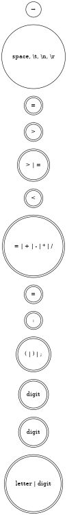

# 编译原理实验

## 实验要求

以下列词法表为例：

| 词法单元类型 | 词法单元  | 词素           |
| ------------ | --------- | -------------- |
| 关键字       | IF        | if             |
|              | THEN      | then           |
|              | ELSE      | else           |
|              | END       | end            |
|              | REPEAT    | repeat         |
|              | UNTIL     | until          |
|              | READ      | read           |
|              | WRITE     | write          |
| 自定义符     | ID        | example_id     |
|              | NUM       | 123            |
| 运算符       | ASSIGN    | :=             |
|              | RELOP     | =              |
|              |           | <>             |
|              |           | >              |
|              |           | <              |
|              |           | >=             |
|              |           | <=             |
|              | PLUS      | +              |
|              | MINUS     | -              |
|              | TIMES     | *              |
|              | OVER      | /              |
|              | LPAREN    | (              |
|              | RPAREN    | )              |
|              | SEMI      | ;              |
| 空格         | DELIMETER | space \t \n \r |

对于输入：

```pascal
read x; // input x
if 0 < x then /* compute when x>0 */
  fact := 1;
  repeat
    fact := fact * X;
    x := x-1
  until x = 0;
  write fact //output fact
end
```

它的词法分析输出应该为：

| tag                       | attr     |
| ------------------------- | -------- |
| READ                      |          |
| ID                        | 1        |
| SEMI                      | ;        |
| IF                        |          |
| NUM                       | 0.000000 |
| RELOP                     | <        |
| ID                        | 1        |
| THEN                      |          |
| ID                        | 2        |
| ASSIGN                    | :=       |
| NUM                       | 1.000000 |
| SEMI                      | ;        |
| REPEAT                    |          |
| ID                        | 2        |
| ASSIGN                    | :=       |
| ID                        | 2        |
| TIMES                     | *        |
| ID                        | 1        |
| SEMI                      | :        |
| ID                        | 1        |
| ASSIGN                    | :=       |
| ID                        | 1        |
| MINUS                     | -        |
| NUM                       | 1.000000 |
| UNTIL                     |          |
| ID                        | 1        |
| RELOP                     | =        |
| NUM                       | 0.000000 |
| SEMI                      | ;        |
| WRITE                     |          |
| ID                        | 2        |
| DOLLAR                    | $        |
| Annotations :             |          |
| // input x                |          |
| /\* compute when x > 0 */ |          |
| // output fact            |          |

## 词法分析



### 状态说明

- 状态0：初态，遇到space等DELIMETER时回到初态，遇到字母进入状态1，遇到数字进入状态2，遇到(|)|;进入状态4，遇到":"进入状态5，遇到=|+|-|*|/进入状态7，遇到<进入状态8，遇到>进入状态10。
- 状态1：终态，对应保留字或标识符。遇到字母或数字保留在状态1。
- 状态2：对应整数。遇到数字保留在状态2，遇到“.”进入状态3。
- 状态3：对应小数。遇到数字保留在状态3。
- 状态4：对应分割符。
- 状态5：中间状态，遇到“=”进入状态6。
- 状态6：终态，对应ASSIGN。
- 状态7：终态，对应运算符。
- 状态8：中间状态，遇到>或=进入状态9。
- 状态9：终态，对应RELOP。
- 状态10：中间状态，遇到=进入状态11。
- 状态11：终态，对应RELOP。

### 词法分析器代码实现

以下是词法分析器的部分代码实现：

```c
#include <stdio.h>
#include <ctype.h>
#include <string.h>
#include <stdlib.h>

typedef enum {
    READ, ID, SEMI, IF, NUM, RELOP, THEN, ASSIGN, REPEAT, TIMES, UNTIL, WRITE, MINUS, DOLLAR, END, ELSE, COMMENT, PLUS, OVER, LPAREN, RPAREN
} TokenType;

void printToken(TokenType token, const char *attr) {
    const char *tokenNames[] = {
        "READ", "ID", "SEMI", "IF", "NUM", "RELOP", "THEN", "ASSIGN", "REPEAT", "TIMES", "UNTIL", "WRITE", "MINUS", "DOLLAR", "END", "ELSE", "COMMENT", "PLUS", "OVER", "LPAREN", "RPAREN"};
    printf("%s\t%s\n", tokenNames[token], attr);
}

typedef struct {
    char name[256];
    int id;
} Symbol;

Symbol symbolTable[256];
int symbolCount = 0;

int lookupSymbol(const char *name) {
    for (int i = 0; i < symbolCount; i++) {
        if (strcmp(symbolTable[i].name, name) == 0) {
            return symbolTable[i].id;
        }
    }
    return -1;
}

int addSymbol(const char *name) {
    strcpy(symbolTable[symbolCount].name, name);
    symbolTable[symbolCount].id = symbolCount + 1;
    return symbolTable[symbolCount++].id;
}
```

上面的代码定义了词法单元的类型、打印词法单元的函数以及符号表的相关操作。

```c
void processFile(const char *filePath) {
    FILE *file = fopen(filePath, "r");
    if (!file) {
        perror("Failed to open file");
        exit(EXIT_FAILURE);
    }

    char buffer[256];
    int bufferIndex = 0;
    int c;
    char annotations[1024] = "";
    int annotationIndex = 0;

    while ((c = fgetc(file)) != EOF) {
        if (isspace(c)) {
            continue;
        }

        if (isalpha(c)) {
            bufferIndex = 0;
            while (isalpha(c) || isdigit(c)) {
                buffer[bufferIndex++] = c;
                c = fgetc(file);
            }
            buffer[bufferIndex] = '\0';
            ungetc(c, file);

            if (strcmp(buffer, "read") == 0) {
                printToken(READ, "");
            } else if (strcmp(buffer, "if") == 0) {
                printToken(IF, "");
            } else if (strcmp(buffer, "then") == 0) {
                printToken(THEN, "");
            } else if (strcmp(buffer, "repeat") == 0) {
                printToken(REPEAT, "");
            } else if (strcmp(buffer, "until") == 0) {
                printToken(UNTIL, "");
            } else if (strcmp(buffer, "write") == 0) {
                printToken(WRITE, "");
            } else if (strcmp(buffer, "end") == 0) {
                printToken(END, "");
            } else if (strcmp(buffer, "else") == 0) {
                printToken(ELSE, "");
            } else {
                int id = lookupSymbol(buffer);
                if (id == -1) {
                    id = addSymbol(buffer);
                }
                char idStr[10];
                sprintf(idStr, "%d", id);
                printToken(ID, idStr);
            }
        } else if (isdigit(c)) {
            bufferIndex = 0;
            while (isdigit(c)) {
                buffer[bufferIndex++] = c;
                c = fgetc(file);
            }
            if (c == '.') {
                buffer[bufferIndex++] = c;
                c = fgetc(file);
                while (isdigit(c)) {
                    buffer[bufferIndex++] = c;
                    c = fgetc(file);
                }
            }
            buffer[bufferIndex] = '\0';
            ungetc(c, file);
            double num = atof(buffer);
            sprintf(buffer, "%.6f", num);
            printToken(NUM, buffer);
        } else if (c == '/') {
            c = fgetc(file);
            if (c == '/') {
                // Single line comment
                bufferIndex = 0;
                buffer[bufferIndex++] = '/';
                buffer[bufferIndex++] = '/';
                while ((c = fgetc(file)) != '\n' && c != EOF) {
                    buffer[bufferIndex++] = c;
                }
                buffer[bufferIndex] = '\0';
                strcat(annotations, buffer);
                strcat(annotations, "\n");
            } else if (c == '*') {
                // Multi-line comment
                bufferIndex = 0;
                buffer[bufferIndex++] = '/';
                buffer[bufferIndex++] = '*';
                while (1) {
                    c = fgetc(file);
                    if (c == EOF) {
                        break;
                    }
                    buffer[bufferIndex++] = c;
                    if (c == '*') {
                        c = fgetc(file);
                        if (c == '/') {
                            buffer[bufferIndex++] = '/';
                            break;
                        } else {
                            ungetc(c, file);
                        }
                    }
                }
                buffer[bufferIndex] = '\0';
                strcat(annotations, buffer);
                strcat(annotations, "\n");
            } else {
                ungetc(c, file);
                printToken(OVER, "/");
            }
        } else {
            switch (c) {
            case ';':
                printToken(SEMI, ";");
                break;
            case ':':
                if ((c = fgetc(file)) == '=') {
                    printToken(ASSIGN, ":=");
                } else {
                    ungetc(c, file);
                }
                break;
            case '<':
                if ((c = fgetc(file)) == '=' || c == '>') {
                    buffer[0] = '<';
                    buffer[1] = c;
                    buffer[2] = '\0';
                    printToken(RELOP, buffer);
                } else {
                    ungetc(c, file);
                    printToken(RELOP, "<");
                }
                break;
            case '>':
                if ((c = fgetc(file)) == '=') {
                    printToken(RELOP, ">=");
                } else {
                    ungetc(c, file);
                    printToken(RELOP, ">");
                }
                break;
            case '=':
                printToken(RELOP, "=");
                break;
            case '+':
                printToken(PLUS, "+");
                break;
            case '-':
                printToken(MINUS, "-");
                break;
            case '*':
                printToken(TIMES, "*");
                break;
            case '(':
                printToken(LPAREN, "(");
                break;
            case ')':
                printToken(RPAREN, ")");
                break;
            default:
                break;
            }
        }
    }

    fclose(file);

    // Print annotations
    printf("Annotations :\n%s", annotations);
}

int main(int argc, char *argv[]) {
    if (argc != 2) {
        fprintf(stderr, "Usage: %s <file_path>\n", argv[0]);
        return EXIT_FAILURE;
    }

    processFile(argv[1]);

    return EXIT_SUCCESS;
}
```

上面的代码实现了词法分析器的主要逻辑，包括处理关键字、标识符、数字、运算符、分隔符和注释等。

### 心得体会

在实现词法分析器的过程中，我们遇到了多个挑战，特别是在处理多行注释时。以下是我们在处理多行注释时的几个版本的代码以及遇到的问题：

#### 初始版本

在初始版本中，我们简单地处理多行注释，假设注释的结束符 `*/` 总是会正确出现。然而，这种假设在实际情况下并不总是成立。

```c
if (c == '*') {
    while ((c = fgetc(file)) != '/' && c != EOF) {
        buffer[bufferIndex++] = c;
    }
    buffer[bufferIndex++] = '/';
}
```

#### 改进版本

在改进版本中，我们增加了对 `EOF` 的检查，以确保在文件结束时能够正确处理未闭合的注释。然而，这个版本仍然存在一个问题：如果多行注释内出现了单个的 `*` 号，其后面不是 `/`，那么会导致这个符号后面的字符丢失。

```c
if (c == '*') {
    while (1) {
        c = fgetc(file);
        if (c == EOF) {
            break;
        }
        buffer[bufferIndex++] = c;
        if (c == '*') {
            c = fgetc(file);
            if (c == '/') {
                buffer[bufferIndex++] = '/';
                break;
            }
        }
    }
}
```

#### 最终版本

在最终版本中，我们通过使用 `ungetc` 函数来解决上述问题。具体来说，当我们遇到 `*` 号时，会读取下一个字符，如果不是 `/`，则将其放回输入流中。这种方法确保了多行注释内的所有字符都能被正确处理。

```c
if (c == '*') {
    while (1) {
        c = fgetc(file);
        if (c == EOF) {
            break;
        }
        buffer[bufferIndex++] = c;
        if (c == '*') {
            c = fgetc(file);
            if (c == '/') {
                buffer[bufferIndex++] = '/';
                break;
            } else {
                ungetc(c, file);
            }
        }
    }
}
```

#### 短路机制的问题

在处理多行注释时，我们还遇到了C语言的短路机制问题。具体来说，只有当当前字符是 `*` 时，才有可能执行 `fgetc`，并且才需要调用 `ungetc`。这种短路机制导致我们在编写代码时需要特别小心，以确保逻辑的正确性。

```c
if (c == '*') {
    c = fgetc(file);
    if (c == '/') {
        buffer[bufferIndex++] = '/';
        break;
    } else {
        ungetc(c, file);
    }
}
```

通过这些改进和优化，我们最终实现了一个能够正确处理各种输入的词法分析器。这不仅提高了我们的编程技巧，也加深了我们对编译原理的理解。

## 语法分析

以下是根据之前定义的词法单元构建的文法：

```plaintext
<program> ::= <stmt_list>

<stmt_list> ::= <stmt> ; <stmt_list> | <stmt>

<stmt> ::= <if_stmt> | <repeat_stmt> | <assign_stmt> | <read_stmt> | <write_stmt>

<if_stmt> ::= IF <exp> THEN <stmt_list> END | IF <exp> THEN <stmt_list> ELSE <stmt_list> END

<repeat_stmt> ::= REPEAT <stmt_list> UNTIL <exp>

<assign_stmt> ::= ID ASSIGN <exp>

<read_stmt> ::= READ ID

<write_stmt> ::= WRITE <exp>

<exp> ::= <simple_exp> <comparison_op> <simple_exp> | <simple_exp>

<comparison_op> ::= RELOP

<simple_exp> ::= <term> <add_op> <simple_exp> | <term>

<add_op> ::= PLUS | MINUS

<term> ::= <factor> <mul_op> <term> | <factor>

<mul_op> ::= TIMES | OVER

<factor> ::= LPAREN <exp> RPAREN | ID | NUM
```

### 文法处理

在后续的图表中，我们将使用简写符号来表示非终结符和终结符。大写字母代表非终结符，小写字母代表终结符。例如：

- `<program>` 用 `P` 表示
- `<stmt_list>` 用 `SL` 表示
- `<stmt>` 用 `S` 表示
- `<if_stmt>` 用 `I` 表示
- `<repeat_stmt>` 用 `R` 表示
- `<assign_stmt>` 用 `A` 表示
- `<read_stmt>` 用 `RD` 表示
- `<write_stmt>` 用 `W` 表示
- `<exp>` 用 `E` 表示
- `<comparison_op>` 用 `RO` 表示
- `<simple_exp>` 用 `SE` 表示
- `<add_op>` 用 `AO` 表示
- `<term>` 用 `T` 表示
- `<mul_op>` 用 `MO` 表示
- `<factor>` 用 `F` 表示

LL(1) 文法需要先提取左公因子。以下是提取左公因子后的文法：

```plaintext
P → SL

SL → S SL'

SL' → ; SL | ε

S → I | R | A | RD | W

I → if E then SL I'

I' → end | else SL end

R → repeat SL until E

A → id := E

RD → read id

W → write E

E → SE E'

E' → RO SE | ε

RO → relop

SE → T SE'

SE' → AO T SE' | ε

AO → plus | minus

T → F T'

T' → MO F T' | ε

MO → times | over

F → ( E ) | id | num
```

### First 集和 Follow 集

以下是每个非终结符的 First 集和 Follow 集：

<table>
    <tr>
        <th>非终结符</th>
        <th>缩写</th>
        <th>文法表达式</th>
        <th>First 集</th>
        <th>Follow 集</th>
    </tr>
    <tr>
        <td>Program</td>
        <td>P</td>
        <td>P → SL</td>
        <td>if</br>repeat</br>id</br>read</br>write</td>
        <td>$</td>
    </tr>
    <tr>
        <td>StmtList</td>
        <td>SL</td>
        <td>SL → S SL'</td>
        <td>if</br>repeat</br>id</br>read</br>write</td>
        <td>$</br>end</br>else</br>until</td>
    </tr>
    <tr>
        <td rowspan="2">StmtList'</td>
        <td rowspan="2">SL'</td>
        <td>SL' → ; SL</td>
        <td>;</td>
        <td rowspan="2">$</br>end</br>else</br>until</td>
    </tr>
    <tr>
        <td>SL' → ε</td>
        <td>$</br>end</br>else</br>until</td>
    </tr>
    <tr>
        <td rowspan="5">Stmt</td>
        <td rowspan="5">S</td>
        <td>S → I</td>
        <td>if</td>
        <td rowspan="5">;</br>$</br>end</br>else</br>until</td>
    </tr>
    <tr>
        <td>S → R</td>
        <td>repeat</td>
    </tr>
    <tr>
        <td>S → A</td>
        <td>id</td>
    </tr>
    <tr>
        <td>S → RD</td>
        <td>read</td>
    </tr>
    <tr>
        <td>S → W</td>
        <td>write</td>
    </tr>
    <tr>
        <td>IfStmt</td>
        <td>I</td>
        <td>I → if E then SL I'</td>
        <td>if</td>
        <td>;</br>$</br>end</br>else</br>until</td>
    </tr>
    <tr>
        <td rowspan="2">IfStmt'</td>
        <td rowspan="2">I'</td>
        <td>I' → end</td>
        <td>end</td>
        <td rowspan="2">;</br>$</br>end</br>else</br>until</td>
    </tr>
    <tr>
        <td>I' → else SL end</td>
        <td>else</td>
    </tr>
    <tr>
        <td>RepeatStmt</td>
        <td>R</td>
        <td>R → repeat SL until E</td>
        <td>repeat</td>
        <td>;</br>$</br>end</br>else</br>until</td>
    </tr>
    <tr>
        <td>AssignStmt</td>
        <td>A</td>
        <td>A → id := E</td>
        <td>id</td>
        <td>;</br>$</br>end</br>else</br>until</td>
    </tr>
    <tr>
        <td>ReadStmt</td>
        <td>RD</td>
        <td>RD → read id</td>
        <td>read</td>
        <td>;</br>$</br>end</br>else</br>until</td>
    </tr>
    <tr>
        <td>WriteStmt</td>
        <td>W</td>
        <td>W → write E</td>
        <td>write</td>
        <td>;</br>$</br>end</br>else</br>until</td>
    </tr>
    <tr>
        <td>Exp</td>
        <td>E</td>
        <td>E → SE E'</td>
        <td>(</br>id</br>num</td>
        <td>then</br>;</br>$</br>end</br>else</br>until</br>)</td>
    </tr>
    <tr>
        <td rowspan="2">Exp'</td>
        <td rowspan="2">E'</td>
        <td>E' → RO SE</td>
        <td>relop</td>
        <td rowspan="2">then</br>;</br>$</br>end</br>else</br>until</br>)</td>
    </tr>
    <tr>
        <td>E' → ε</td>
        <td>then</br>;</br>$</br>end</br>else</br>until</br>)</td>
    </tr>
    <tr>
        <td>RelOp</td>
        <td>RO</td>
        <td>RO → relop</td>
        <td>relop</td>
        <td>(</br>id</br>num</td>
    </tr>
    <tr>
        <td>SimpleExp</td>
        <td>SE</td>
        <td>SE → T SE'</td>
        <td>(</br>id</br>num</td>
        <td>then</br>;</br>$</br>end</br>else</br>until</br>)</td>
    </tr>
    <tr>
        <td rowspan="2">SimpleExp'</td>
        <td rowspan="2">SE'</td>
        <td>SE' → AO T SE'</td>
        <td>plus</br>minus</td>
        <td rowspan="2">then</br>;</br>$</br>end</br>else</br>until</br>)</td>
    </tr>
    <tr>
        <td>SE' → ε</td>
        <td>then</br>;</br>$</br>end</br>else</br>until</br>)</td>
    </tr>
    <tr>
        <td rowspan="2">AddOp</td>
        <td rowspan="2">AO</td>
        <td>AO → plus</td>
        <td>plus</td>
        <td rowspan="2">(</br>id</br>num</td>
    </tr>
    <tr>
        <td>AO → minus</td>
        <td>minus</td>
    </tr>
    <tr>
        <td>Term</td>
        <td>T</td>
        <td>T → F T'</td>
        <td>(</br>id</br>num</td>
        <td>plus</br>minus</br>then</br>;</br>$</br>end</br>else</br>until</br>)</td>
    </tr>
    <tr>
        <td rowspan="2">Term'</td>
        <td rowspan="2">T'</td>
        <td>T' → MO F T'</td>
        <td>times</br>over</td>
        <td rowspan="2">plus</br>minus</br>then</br>;</br>$</br>end</br>else</br>until</br>)</td>
    </tr>
    <tr>
        <td>T' → ε</td>
        <td>plus</br>minus</br>then</br>;</br>$</br>end</br>else</br>until</br>)</td>
    </tr>
    <tr>
        <td rowspan="2">MulOp</td>
        <td rowspan="2">MO</td>
        <td>MO → times</td>
        <td>times</td>
        <td rowspan="2">(</br>id</br>num</td>
    </tr>
    <tr>
        <td>MO → over</td>
        <td>over</td>
    </tr>
    <tr>
        <td rowspan="3">Factor</td>
        <td rowspan="3">F</td>
        <td>F → ( E )</td>
        <td>(</td>
        <td rowspan="3">times</br>over</br>plus</br>minus</br>then</br>;</br>$</br>end</br>else</br>until</br>)</td>
    </tr>
    <tr>
        <td>F → id</td>
        <td>id</td>
    </tr>
    <tr>
        <td>F → num</td>
        <td>num</td>
    </tr>
</table>

### LL(1) 分析表

以下是根据之前定义的 LL(1) 文法构建的 LL(1) 分析表：

|         | if                | repeat              | id          | read        | write       | ;        | end    | else           | until | relop    | plus         | minus        | times      | over       | (          | )     | num        | :=  | then  | $     |
| ------- | ----------------- | ------------------- | ----------- | ----------- | ----------- | -------- | ------ | -------------- | ----- | -------- | ------------ | ------------ | ---------- | ---------- | ---------- | ----- | ---------- | --- | ----- | ----- |
| **P**   | P→SL              | P→SL                | P→SL        | P→SL        | P→SL        |          |        |                |       |          |              |              |            |            |            |       |            |     |       |       |
| **SL**  | SL -> S SL'       | SL -> S SL'         | SL -> S SL' | SL -> S SL' | SL -> S SL' |          |        |                |       |          |              |              |            |            |            |       |            |     |       |       |
| **SL'** |                   |                     |             |             |             | SL'→;SL' | SL'→ε  | SL'→ε          | SL'→ε |          |              |              |            |            |            |       |            |     |       | SL'→ε |
| **S**   | S→I               | S→R                 | S→A         | S→RD        | S→W         |          |        |                |       |          |              |              |            |            |            |       |            |     |       |       |
| **I**   | I→if E then SL I' |                     |             |             |             |          |        |                |       |          |              |              |            |            |            |       |            |     |       |       |
| **I'**  |                   |                     |             |             |             |          | I'→end | I'→else SL end |       |          |              |              |            |            |            |       |            |     |       |       |
| **R**   |                   | R→repeat SL until E |             |             |             |          |        |                |       |          |              |              |            |            |            |       |            |     |       |       |
| **A**   |                   |                     | A→id := E   |             |             |          |        |                |       |          |              |              |            |            |            |       |            |     |       |       |
| **RD**  |                   |                     |             | RD→read id  |             |          |        |                |       |          |              |              |            |            |            |       |            |     |       |       |
| **W**   |                   |                     |             |             | W→write E   |          |        |                |       |          |              |              |            |            |            |       |            |     |       |       |
| **E**   |                   |                     | E -> SE E'  |             |             |          |        |                |       |          |              |              |            |            | E -> SE E' |       | E -> SE E' |     |       |       |
| **E'**  |                   |                     |             |             |             | E'→ε     | E'→ε   | E'→ε           | E'→ε  | E'→RO SE |              |              |            |            |            | E'→ε  |            |     | E'→ε  | E'→ε  |
| **RO**  |                   |                     |             |             |             |          |        |                |       | RO→relop |              |              |            |            |            |       |            |     |       |       |
| **SE**  |                   |                     | SE→T SE'    |             |             |          |        |                |       |          |              |              |            |            | SE→T SE'   |       | SE→T SE'   |     |       |       |
| **SE'** |                   |                     |             |             |             | SE'→ε    | SE'→ε  | SE'→ε          | SE'→ε |          | SE'→AO T SE' | SE'→AO T SE' |            |            |            | SE'→ε |            |     | SE'→ε | SE'→ε |
| **AO**  |                   |                     |             |             |             |          |        |                |       |          | AO→plus      | AO→minus     |            |            |            |       |            |     |       |       |
| **T**   |                   |                     | T→F T'      |             |             |          |        |                |       |          |              |              |            |            | T→F T'     |       | T→F T'     |     |       |       |
| **T'**  |                   |                     |             |             |             | T'→ε     | T'→ε   | T'→ε           | T'→ε  |          | T'→ε         | T'→ε         | T'→MO F T' | T'→MO F T' |            | T'→ε  |            |     | T'→ε  | T'→ε  |
| **MO**  |                   |                     |             |             |             |          |        |                |       |          |              |              | MO→times   | MO→over    |            |       |            |     |       |       |
| **F**   |                   |                     | F→id        |             |             |          |        |                |       |          |              |              |            |            | F→(E)      |       | F→num      |     |       |       |

### 语法分析器代码实现
